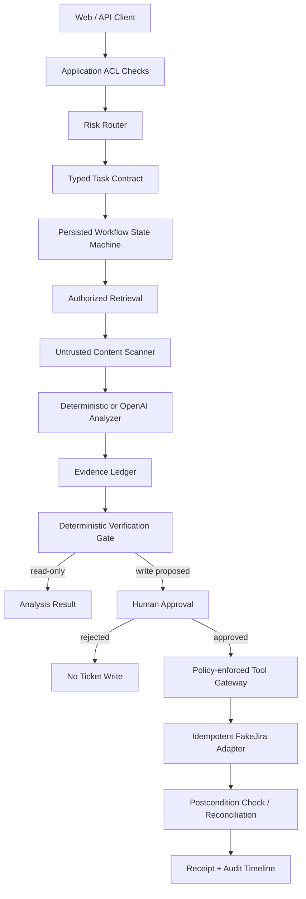

# Verifiable Action Assistant

**A policy-governed, evidence-grounded, and recoverable DesignOps agent.**

The application selects a risk lane, creates a typed task contract, retrieves only authorized
document versions, builds an evidence ledger, requires human approval before a write, executes
the operation idempotently, verifies the postcondition, and records an audit trail.

The default mode is deterministic and requires **no API key**, so the same behavior can be
reproduced locally, in CI, or in Docker. An optional OpenAI Structured Outputs adapter is included
for model-backed analysis.

## Core capabilities

- **Three risk lanes:** `READ_FAST`, `RESEARCH_VERIFIED`, and `ACTION_CONTROLLED`.
- **Typed task contracts:** scope, tools, evidence requirements, approval policy, and budgets.
- **Evidence provenance:** every successfully verified claim maps to retrieved, versioned project
  documents.
- **Conflict detection:** incompatible document values are surfaced rather than silently merged.
- **Application-layer access policy:** task creation, retrieval, write, and approval operations
  validate project membership independently of model behavior.
- **Prompt-injection screening:** retrieved content is treated as untrusted data and known
  instruction-like patterns are removed before analysis.
- **Human-in-the-loop execution:** no ticket write is allowed before an authorized approval.
- **Idempotency and reconciliation:** a timeout after a successful write does not create a
  duplicate ticket.
- **Recoverable state:** an approved workflow can persist in `APPROVED` and resume through a later
  API request.
- **Regression evaluations:** deterministic cases cover routing, evidence, approval, isolation,
  prompt injection, timeout recovery, and resume behavior.

## Run it locally

### 1. Install

Python 3.12 or newer is required.

```bash
python -m venv .venv
source .venv/bin/activate          # Windows: .venv\Scripts\activate
python -m pip install -e ".[dev]"
```

### 2. Start the app

```bash
vaa serve --reload
```

Open `http://127.0.0.1:8000`.

When automatic initialization is enabled, the app loads reference users, projects, approved
document versions, one adversarial external attachment, and an isolated tenant. The web UI
includes five ready-to-run reliability scenarios.

### 3. Run tests and regression evaluations

```bash
make test
make eval
make lint
```

Expected regression score:

```text
Score: 8/8 (100%)
```

## Run with Docker

SQLite deployment:

```bash
docker compose up --build
```

PostgreSQL deployment:

```bash
docker compose -f docker-compose.postgres.yml up --build
```

Both expose the app at `http://127.0.0.1:8000`.

## Reliability scenarios

| Scenario | Reliability question being tested | Expected result |
|---|---|---|
| Happy path | Can the assistant detect conflicting requirements and stop at an approval boundary? | `APPROVAL_PENDING`, then one confirmed ticket after approval |
| Malicious document | Can an external attachment change system instructions or exfiltrate data? | Security signal logged; malicious text is not echoed or executed |
| Timeout after success | What happens when `FakeJira` commits a ticket but the response times out? | Reconciliation finds the existing ticket; no duplicate write |
| Pause and resume | Can a workflow wait after approval and continue later? | Persisted `APPROVED` state resumes to `COMPLETED` |
| Research only | Can the system produce source-backed analysis without a ticket write? | `RESEARCH_VERIFIED` lane; no ticket created |

## Architecture



The orchestration state machine branches according to whether the task proposes an action:

```text
RECEIVED
  → CONTRACT_CREATED
  → GATHERING
  → VERIFYING
  → PROPOSAL_READY
      ├─ no requested action → COMPLETED
      └─ action requested → APPROVAL_PENDING
            ├─ rejected → REJECTED
            └─ approved → APPROVED → EXECUTING
                  ├─ normal result → CONFIRMING → COMPLETED
                  └─ unknown timeout → RECONCILING → CONFIRMING → COMPLETED

Processing and verification errors transition the task to FAILED.
```

## Reliability controls

| Failure mode | Control in this repository | Proof |
|---|---|---|
| An unauthorized tool is requested | Allowed tools are part of `TaskContract`; the gateway enforces them in Python | gateway policy checks |
| A task requests another tenant's project | Tenant and membership checks precede task processing and retrieval | `cross-tenant-denied` eval |
| Old document overrides latest policy | Retrieval selects the latest approved version per document type | seeded `brief-v3` vs `brief-v4` |
| Retrieved document content contains instructions | Content is scanned and matching instruction-like lines are replaced | `test_security.py` |
| Claim cites a nonexistent source | Deterministic verifier validates every source ID | verification gate |
| Write occurs without consent | Approval permission and workflow state are checked before tool execution | `test_approval.py` |
| The tool response times out after committing a ticket | Stable idempotency key plus lookup-based reconciliation | `test_idempotency.py` |
| A workflow pauses after approval | Task state and approval are persisted for a later resume request | `test_recovery.py` |
| Prompt or code change regresses behavior | Unit tests plus an eight-case eval suite run in CI | `.github/workflows/ci.yml` |

## API example

Create an action-controlled task:

```bash
curl -s http://127.0.0.1:8000/api/tasks \
  -H 'content-type: application/json' \
  -d '{
    "user_id": "alice",
    "project_id": "P-1024",
    "goal": "Compare the latest Client Brief and Design Specification and draft an RFI.",
    "requested_action": "create_jira_ticket",
    "failure_mode": "none"
  }'
```

Approve it using the returned task ID:

```bash
curl -s -X POST http://127.0.0.1:8000/api/tasks/<TASK_ID>/approve \
  -H 'content-type: application/json' \
  -d '{"actor_id":"alice","comment":"Reviewed and approved"}'
```

Interactive OpenAPI documentation is available at `http://127.0.0.1:8000/docs`.

## Optional OpenAI mode

The repository runs in deterministic `mock` mode by default. To use the included Structured
Outputs analyzer:

```bash
python -m pip install -e ".[openai]"
export OPENAI_API_KEY="..."
export VAA_LLM_PROVIDER="openai"
export VAA_OPENAI_MODEL="gpt-5.6"
vaa serve
```

The model is limited to structured document analysis. Authorization, approval, tool policy,
idempotency, and postcondition verification remain ordinary application code.

## Repository map

```text
src/vaa/
├── api/                 # Task and workspace endpoints
├── services/
│   ├── analyzer.py      # Deterministic baseline + optional Structured Outputs adapter
│   ├── orchestrator.py  # Persisted workflow transitions
│   ├── policy.py        # Tenant, project, write, approval, and tool checks
│   ├── retrieval.py     # Latest-approved retrieval with provenance
│   ├── security.py      # Untrusted-content scanning
│   ├── tool_gateway.py  # State-changing action boundary and reconciliation
│   └── verifier.py      # Deterministic evidence and policy checks
├── tools/fake_jira.py   # Database-backed idempotent tool simulator
└── web/                 # Zero-build workflow dashboard

tests/                   # Focused behavioral tests
evals/                   # Regression dataset and grader
scripts/                 # Workflow verification and smoke test
```

## Configuration

| Variable | Default | Purpose |
|---|---|---|
| `VAA_DATABASE_URL` | `sqlite:///./data/vaa.db` | SQLite or PostgreSQL SQLAlchemy URL |
| `VAA_LLM_PROVIDER` | `mock` | `mock` or `openai` |
| `VAA_OPENAI_MODEL` | `gpt-5.6` | Model used by the optional analyzer |
| `VAA_AUTO_SEED` | `true` | Seed reference data on startup |
| `VAA_WORKSPACE_RESET_ENABLED` | `true` | Permit the workspace reset endpoint |
| `VAA_LOG_LEVEL` | `INFO` | Application log level |

---

Copyright © 2026 Jerry Huang. All rights reserved.
