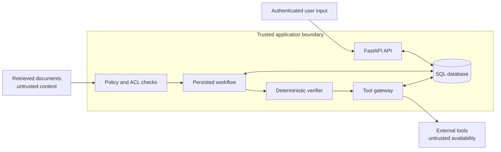
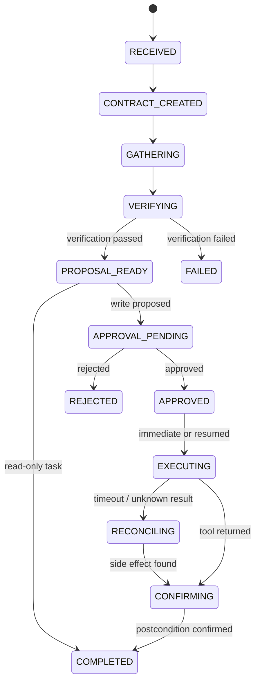
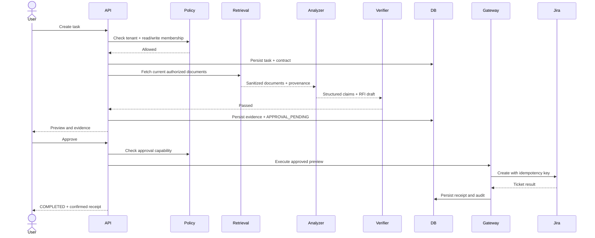
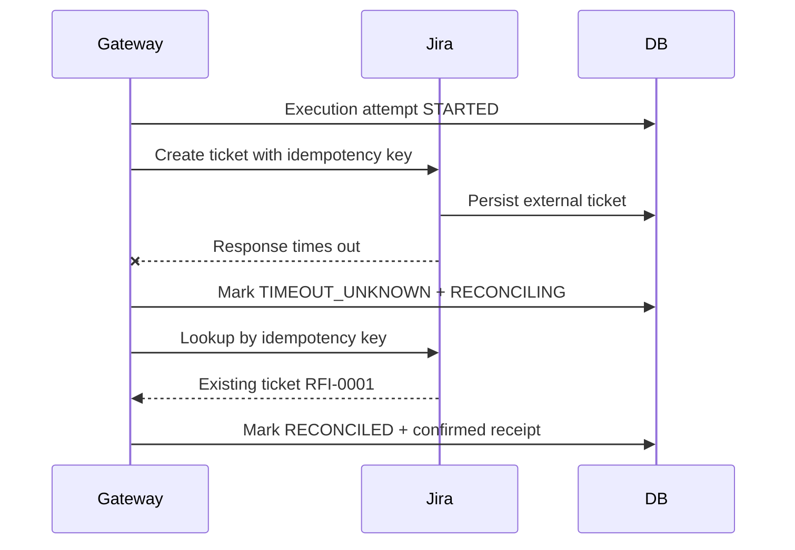

# Architecture

## 1. Design goal

The assistant must answer a project question and, when requested, create an external ticket.
The difficult part is not text generation. The difficult part is preserving system invariants
when evidence conflicts, permissions differ, retrieved files contain hostile instructions, a
human rejects the action, or a tool succeeds but its response is lost.

The reference implementation therefore separates probabilistic analysis from deterministic
control.

## 2. Trust boundaries

The model is not a security boundary. It may analyze only the data supplied to it and returns a
validated schema. It cannot grant itself access, alter the task contract, approve an action, or
write directly to the external system.

## 3. Components

### API layer

`src/vaa/api/` exposes task creation, inspection, approval, rejection, resume, demo reset, and
fake-ticket inspection. Domain errors are converted to explicit HTTP responses.

### Risk router

`services/router.py` selects one of three lanes:

- `READ_FAST`: low-risk, read-only lookup.
- `RESEARCH_VERIFIED`: evidence-heavy comparison or review.
- `ACTION_CONTROLLED`: any task requesting a write.

The router also creates `TaskContract`, which records allowed tools, evidence requirements,
approval policy, budgets, tenant, project, and success criteria.

### Policy layer

`services/policy.py` enforces:

1. user and project exist;
2. user and project share a tenant;
3. the user has project membership;
4. read, write, and approve capabilities are checked separately;
5. a tool is listed in the task contract;
6. a write occurs only from an approved workflow state.

### Retrieval and provenance

`services/retrieval.py` selects the latest approved document per document type inside the
already-authorized tenant and project. It returns typed records containing source ID, title,
version, trust level, approval time, sanitized content, security signals, and a simple relevance
score.

The lexical retriever is deliberately small and inspectable. It can later be replaced by hybrid
search without changing the policy or evidence interfaces.

### Untrusted-content scanner

`services/security.py` identifies a compact set of instruction-override, exfiltration,
system-prompt, and concealment patterns. Matching lines are replaced before they reach either
analyzer. Signals are preserved in the task audit.

This is defense in depth, not a complete prompt-injection solution. The main protection is that
retrieved data cannot expand permissions or tool scope.

### Analyzer

`services/analyzer.py` has two adapters:

- `DeterministicAnalyzer`: reproducible extraction of workstation counts, aisle widths,
  handover dates, and acoustic NRC values.
- `OpenAIAnalyzer`: optional Structured Outputs analysis using the same `AnalysisResult`
  boundary.

Both return claims, observed values, source references, conflicts, an RFI draft, and security
signals. Neither can perform a side effect.

### Verification gate

`services/verifier.py` checks:

- every cited source was actually retrieved;
- every claim has a source;
- conflict labels agree with the observed value cardinality;
- malicious instructions were not echoed into the proposal;
- required evidence exists;
- the contract contains the correct write policy.

A failed gate transitions the task to `FAILED` before approval or execution.

### Orchestrator

`services/orchestrator.py` persists every state transition and coordinates retrieval, analysis,
verification, approval, execution, reconciliation, and completion. The state lives in SQL rather
than an in-memory model loop.

### Tool gateway

`services/tool_gateway.py` is the only path to the write-capable tool. It rechecks contract and
write permission, records an execution attempt, sends a stable idempotency key, handles an
unknown timeout result, reconciles against external state, and returns a typed receipt.

### Fake Jira

`tools/fake_jira.py` simulates an external API while preserving the important behavior: the
write is stored before a timeout can be injected. A unique idempotency key makes repeated calls
return the existing ticket instead of creating another visible side effect.

## 4. Happy-path sequence

## 5. Timeout-after-success sequence

The system does not blindly retry an unknown write. It first asks whether the side effect is
already visible.

## 6. Data model

Key tables:

- `users`, `projects`, `project_memberships`: authorization context.
- `documents`: versioned source material and trust level.
- `tasks`: contract, state, analysis, verification, preview, receipt, and error.
- `evidence_records`: claim-level provenance.
- `approvals`: one decision per task.
- `external_tickets`: simulated external state, uniquely keyed by idempotency key.
- `execution_attempts`: tool request, status, response, and error.
- `audit_events`: actor, event type, payload, and timestamp.

## 7. Extension points

Each important boundary has a stable interface:

- replace lexical retrieval with hybrid retrieval;
- replace fake Jira with a typed Jira or MCP adapter;
- replace SQL state transitions with Temporal, DBOS, or another durable engine;
- export audit and span data through OpenTelemetry;
- add policy-as-code without exposing decisions to the model;
- add new domain extractors while preserving `AnalysisResult` and `VerificationResult`.
